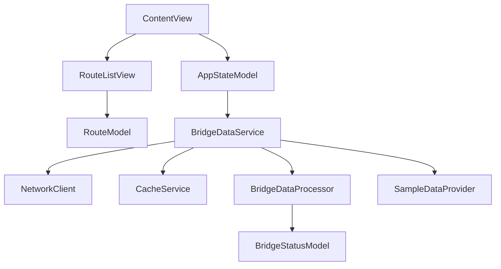

# Architecture Overview

## System Design

Bridget follows a **modular, service-oriented architecture** with clear separation of concerns and reactive state management. The architecture is designed for reliability, testability, and future extensibility.

## Architectural Layers

### 1. Presentation Layer (Views)
**Responsibility**: User interface and user interaction handling

**Components**:
- `ContentView`: Root view coordinator and state management
- `RouteListView`: Main route display with loading states and error handling
- `RouteRowView`: Individual route item display

**Key Characteristics**:
- **Reactive UI**: Uses SwiftUI with Observation framework for automatic updates
- **State-Driven**: Views react to changes in observable models
- **Error-Aware**: Comprehensive error handling with user-friendly messages
- **Loading States**: Proper loading indicators and skeleton placeholders

### 2. Business Logic Layer (Models)
**Responsibility**: Data representation and business rules

**Components**:
- `AppStateModel`: Global application state and navigation
- `BridgeStatusModel`: Bridge data with historical opening information
- `RouteModel`: Route representation with scoring and optimization

**Key Characteristics**:
- **Observable**: Uses `@Observable` for reactive state management
- **Cache-Aware**: Includes cache metadata with `@ObservationIgnored`
- **Immutable Design**: Core data structures are immutable for thread safety
- **Validation**: Built-in data validation and business rule enforcement

### 3. Service Layer (Services)
**Responsibility**: Data access, processing, and external integrations

**Components**:
- `BridgeDataService`: Main orchestrator for data operations
- `NetworkClient`: HTTP networking with retry logic and validation
- `CacheService`: Persistent data storage and retrieval
- `BridgeDataProcessor`: Data transformation and business logic
- `SampleDataProvider`: Mock data generation for testing

**Key Characteristics**:
- **Single Responsibility**: Each service has a focused, well-defined purpose
- **Dependency Injection**: Services are injected for testability
- **Error Handling**: Comprehensive error classification and propagation
- **Caching Strategy**: Cache-first approach with graceful degradation

### 4. Data Layer
**Responsibility**: Raw data access and persistence

**Components**:
- Seattle Open Data API integration
- Local cache storage (UserDefaults/Core Data)
- JSON parsing and serialization

**Key Characteristics**:
- **API Abstraction**: Clean separation between API and business logic
- **Persistence**: Local caching for offline support
- **Data Validation**: Comprehensive input validation and sanitization

## Component Relationships

## Architectural Decisions

### 1. Reactive State Management
**Decision**: Use Apple's Observation framework with `@Observable`
**Rationale**: 
- Automatic UI updates when data changes
- Better performance than older reactive frameworks
- Native SwiftUI integration
- Simplified state management

### 2. Service-Oriented Architecture
**Decision**: Separate concerns into focused service classes
**Rationale**:
- Improved testability through dependency injection
- Clear separation of responsibilities
- Easier to maintain and extend
- Better error isolation and handling

### 3. Cache-First Strategy
**Decision**: Implement cache-first data access with network fallback

## Project Planning & Implementation

**For detailed project planning, implementation phases, and progress tracking, see:**
- **Project Roadmap**: `Documentation/Seattle_Route_Optimization_Plan.md` - Complete implementation roadmap and architectural decisions
- **Current Status**: `Documentation/refinements-integration-summary.md` - Latest refinements and integration status

This document focuses on technical architecture reference. Project planning and implementation tracking is maintained in the `Documentation/` folder.
**Rationale**:
- Improved user experience with faster data access
- Offline support for reliability
- Reduced network usage and costs
- Better performance on slow connections

### 4. Two-Tier Bridge Identity
**Decision**: Separate API bridge IDs from business bridge names
**Rationale**:
- Maintains API compatibility while providing user-friendly names
- Supports traceability between API and business layers
- Enables future API changes without breaking user experience
- Clear separation of technical and business concerns

### 5. Comprehensive Error Handling
**Decision**: Implement detailed error classification and propagation
**Rationale**:
- Better debugging and troubleshooting
- Improved user experience with meaningful error messages
- Support for analytics and monitoring
- Graceful degradation in failure scenarios

## Data Flow

### 1. App Initialization
1. `BridgetApp` creates `ModelContainer` for SwiftData
2. `ContentView` initializes `AppStateModel`
3. `AppStateModel` triggers initial data load via `BridgeDataService`

### 2. Data Loading Process
1. `BridgeDataService` checks cache for valid data
2. If cache is valid, return cached data immediately
3. If cache is stale/missing, fetch from network via `NetworkClient`
4. Process raw data through `BridgeDataProcessor`
5. Update cache with new data via `CacheService`
6. Update UI through reactive state management

### 3. Error Handling Flow
1. Network errors are caught and classified by `NetworkClient`
2. Processing errors are caught and classified by `BridgeDataProcessor`
3. Errors are propagated up to `BridgeDataService`
4. `BridgeDataService` updates `AppStateModel` with error state
5. UI automatically updates to show error messages and retry options

## Performance Considerations

### 1. Memory Management
- **Lazy Loading**: Data is loaded on-demand rather than all at once
- **Cache Eviction**: Automatic cache cleanup to prevent memory bloat
- **Image Optimization**: Efficient image loading and caching strategies

### 2. Network Optimization
- **Retry Logic**: Exponential backoff to handle temporary failures
- **Payload Validation**: Size limits to prevent memory issues
- **Conditional Requests**: Future ETag support for bandwidth optimization

### 3. UI Performance
- **Observation Tracking**: Efficient updates using `withObservationTracking`
- **Lazy Views**: SwiftUI lazy loading for large lists
- **Background Processing**: Heavy operations moved to background queues

## Testing Strategy

### 1. Unit Testing
- **Service Layer**: Mock dependencies for isolated testing
- **Model Layer**: Test business logic and validation
- **Error Scenarios**: Comprehensive error path testing

### 2. Integration Testing
- **API Integration**: Test real API responses and error handling
- **Cache Behavior**: Test cache hit/miss scenarios
- **End-to-End**: Test complete data flow from API to UI

### 3. UI Testing
- **User Interactions**: Test user flows and interactions
- **Loading States**: Verify proper loading indicators
- **Error Handling**: Test error display and retry functionality

## Future Extensibility

### 1. Real-Time Integration
- **WebSocket Support**: Real-time bridge status updates
- **Push Notifications**: Bridge opening alerts
- **Live Traffic**: Integration with traffic APIs

### 2. Machine Learning
- **Core ML Integration**: Predictive route optimization
- **Model Updates**: Dynamic model loading and updates
- **Personalization**: User-specific route preferences

### 3. Advanced Features
- **Multi-City Support**: Extend beyond Seattle
- **Social Features**: User reviews and ratings
- **Advanced Analytics**: Detailed usage statistics and insights

## Security Considerations

### 1. Data Protection
- **Encryption**: Sensitive data encrypted at rest
- **Access Control**: Proper permission handling
- **Data Minimization**: Only collect necessary data

### 2. Network Security
- **HTTPS Only**: All network requests use secure connections
- **Certificate Pinning**: Prevent man-in-the-middle attacks
- **Input Validation**: Comprehensive input sanitization

### 3. Privacy
- **User Consent**: Clear privacy policy and consent mechanisms
- **Data Retention**: Automatic cleanup of old data
- **Anonymization**: User data anonymized where possible 
