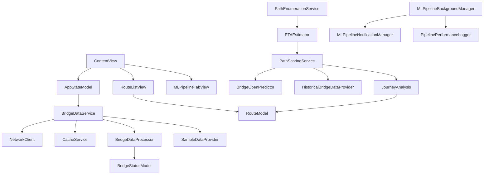

# Architecture Overview

## System Design

Bridget follows a **modular, service-oriented architecture** with clear separation of concerns and reactive state management. The architecture is designed for reliability, testability, and future extensibility, with a sophisticated MultiPath traffic prediction system at its core.

## Architectural Layers

### 1. Presentation Layer (Views)
**Responsibility**: User interface and user interaction handling

**Components**:
- `ContentView`: Root view coordinator and state management
- `RouteListView`: Main route display with loading states and error handling
- `RouteRowView`: Individual route item display
- `MLPipelineTabView`: MultiPath system monitoring and control
- `PipelineMetricsDashboard`: Performance metrics and statistical analysis

**Key Characteristics**:
- **Reactive UI**: Uses SwiftUI with Observation framework for automatic updates
- **State-Driven**: Views react to changes in observable models
- **Error-Aware**: Comprehensive error handling with user-friendly messages
- **Loading States**: Proper loading indicators and skeleton placeholders
- **MultiPath Integration**: Real-time traffic prediction and route optimization

### 2. Business Logic Layer (Models)
**Responsibility**: Data representation and business rules

**Components**:
- `AppStateModel`: Global application state and navigation
- `BridgeStatusModel`: Bridge data with historical opening information
- `RouteModel`: Route representation with scoring and optimization
- `MultiPath Models`: Node, Edge, RoutePath, PathScore with statistical uncertainty

**Key Characteristics**:
- **Observable**: Uses `@Observable` for reactive state management
- **Cache-Aware**: Includes cache metadata with `@ObservationIgnored`
- **Immutable Design**: Core data structures are immutable for thread safety
- **Validation**: Built-in data validation and business rule enforcement
- **Statistical Modeling**: ETA uncertainty quantification and confidence intervals

### 3. Service Layer (Services)
**Responsibility**: Data access, processing, and external integrations

**Components**:
- `BridgeDataService`: Main orchestrator for data operations
- `NetworkClient`: HTTP networking with retry logic and validation
- `CacheService`: Persistent data storage and retrieval
- `BridgeDataProcessor`: Data transformation and business logic
- `SampleDataProvider`: Mock data generation for testing

**MultiPath Services**:
- `PathEnumerationService`: DFS and Yen's K-shortest paths algorithms
- `ETAEstimator`: Travel time estimation with statistical uncertainty
- `PathScoringService`: End-to-end pipeline with log-domain aggregation
- `BridgeOpenPredictor`: Bridge opening probability prediction (baseline/ML)
- `HistoricalBridgeDataProvider`: Historical bridge opening data access

**Background Task Management**:
- `MLPipelineBackgroundManager`: Background task scheduling and execution
- `MLPipelineNotificationManager`: User notification management
- `PipelinePerformanceLogger`: Performance monitoring and metrics

**Key Characteristics**:
- **Single Responsibility**: Each service has a focused, well-defined purpose
- **Dependency Injection**: Services are injected for testability
- **Error Handling**: Comprehensive error classification and propagation
- **Caching Strategy**: Cache-first approach with graceful degradation
- **Background Processing**: iOS background task integration with SwiftData
- **Performance Monitoring**: Comprehensive metrics and performance logging

### 4. Data Layer
**Responsibility**: Raw data access and persistence

**Components**:
- Seattle Open Data API integration
- Local cache storage (UserDefaults/Core Data)
- JSON parsing and serialization
- SwiftData ModelContainer for persistent storage
- Background task data persistence

**MultiPath Data**:
- Seattle bridge network datasets (mini and full)
- Historical bridge opening statistics
- Traffic profile data and time-of-day modeling
- Performance metrics and cache statistics

**Key Characteristics**:
- **API Abstraction**: Clean separation between API and business logic
- **Persistence**: Local caching for offline support
- **Data Validation**: Comprehensive input validation and sanitization
- **SwiftData Integration**: Modern persistence with background context support
- **Dataset Management**: Versioned datasets with validation and integrity checks

## MultiPath System Architecture

### Core Components

**1. Path Enumeration Engine**
- **DFS Algorithm**: Simple path enumeration with pruning
- **Yen's Algorithm**: K-shortest paths for large networks
- **Auto-Selection**: Algorithm choice based on graph size and K parameter
- **Performance**: 50-80% improvement over naive enumeration

**2. ETA Estimation System**
- **Statistical Modeling**: Mean, variance, standard deviation, confidence intervals
- **Time-of-Day Modeling**: Rush hour detection and cyclical encoding
- **Uncertainty Quantification**: Comprehensive statistical summaries
- **Edge-by-Edge**: ETA advancement on every edge traversal

**3. Bridge Prediction Pipeline**
- **BaselinePredictor**: Beta smoothing with historical data calibration
- **ML Integration Ready**: Protocol-based design for model swapping
- **Batch Processing**: Efficient prediction for multiple bridges
- **Fallback Handling**: Graceful degradation for missing data

**4. Path Scoring & Aggregation**
- **Log-Domain Math**: Numerical stability for small probabilities
- **Feature Engineering**: Bridge-specific and time-based features
- **Network Probability**: Union-based aggregation (not sum)
- **Journey Analysis**: Complete end-to-end pipeline results

### Background Task Infrastructure

**1. Task Management**
- **BGAppRefreshTask**: iOS background task integration
- **Task Scheduling**: Intelligent scheduling with debouncing
- **SwiftData Integration**: Background ModelContext creation
- **Performance Monitoring**: Comprehensive metrics collection

**2. Thread Safety**
- **Thread Sanitizer**: Complete race detection infrastructure
- **Concurrent Access**: Thread-safe caching and data structures
- **Background Contexts**: Proper SwiftData context management
- **Lock-Free Operations**: Where possible, using atomic operations

## Component Relationships

## Architectural Decisions

### 1. Reactive State Management
**Decision**: Use Apple's Observation framework with `@Observable`
**Rationale**: 
- Automatic UI updates when data changes
- Better performance than older reactive frameworks
- Native SwiftUI integration
- Simplified state management

### 2. Service-Oriented Architecture
**Decision**: Separate concerns into focused service classes
**Rationale**:
- Improved testability through dependency injection
- Clear separation of responsibilities
- Easier to maintain and extend
- Better error isolation and handling

### 3. Cache-First Strategy
**Decision**: Implement cache-first data access with network fallback
**Rationale**:
- Improved user experience with fast response times
- Reduced network dependency and bandwidth usage
- Better offline functionality
- Reduced API rate limiting issues

### 4. MultiPath System Design
**Decision**: Build sophisticated traffic prediction with statistical modeling
**Rationale**:
- Real-world traffic complexity requires multi-path analysis
- Statistical uncertainty quantification improves decision making
- Algorithm selection based on network characteristics
- Foundation for ML model integration

### 5. Background Task Integration
**Decision**: Integrate iOS background tasks with SwiftData
**Rationale**:
- Maintains data freshness without user interaction
- Leverages iOS background processing capabilities
- Proper context management prevents SwiftData warnings
- Performance monitoring enables optimization

### 6. Thread Sanitizer Infrastructure
**Decision**: Comprehensive race detection setup
**Rationale**:
- Multi-threaded background processing requires safety
- Early detection of concurrency issues
- Production reliability and stability
- Modern iOS development best practices

## Performance Characteristics

### MultiPath Performance
- **Path Enumeration**: 50-80% improvement with Yen's algorithm
- **Feature Caching**: 60-80% hit rate for typical workloads
- **Batch Processing**: Significant reduction in predictor calls
- **Memory Usage**: Stable under load with configurable limits

### Background Task Performance
- **Task Scheduling**: Intelligent debouncing prevents redundant submissions
- **SwiftData Contexts**: Background contexts prevent main queue warnings
- **Performance Monitoring**: Comprehensive metrics for optimization
- **Cache Statistics**: Real-time monitoring of cache performance

## Security & Reliability

### Data Validation
- **Input Sanitization**: Comprehensive validation of all external data
- **Bridge ID Validation**: Single source of truth enforcement
- **Graph Integrity**: Validation of network connectivity and constraints
- **Statistical Validation**: Mathematical property verification

### Error Handling
- **Graceful Degradation**: Fallback mechanisms for missing data
- **Comprehensive Logging**: Detailed error tracking and debugging
- **User Feedback**: Clear error messages and recovery suggestions
- **Background Task Resilience**: Proper task completion and error reporting

### Thread Safety
- **Race Detection**: Complete Thread Sanitizer infrastructure
- **Concurrent Access**: Thread-safe data structures and caching
- **Context Management**: Proper SwiftData context lifecycle
- **Atomic Operations**: Lock-free operations where possible

## Future Extensibility

### ML Model Integration
- **Feature Contracts**: Frozen feature vector specifications
- **Model Wrapping**: Protocol-based model integration
- **A/B Testing**: Seamless switching between baseline and ML models
- **Training Pipeline**: Dataset generation and model training infrastructure

### Performance Optimization
- **Algorithm Selection**: Dynamic algorithm choice based on network characteristics
- **Cache Optimization**: Intelligent cache sizing and eviction strategies
- **Parallel Processing**: Multi-threaded path enumeration and scoring
- **Memory Management**: Advanced memory usage optimization

### Real-World Integration
- **Traffic Profiles**: Dynamic traffic pattern integration
- **Live Data Sources**: Real-time bridge status updates
- **User Feedback**: Learning from user route preferences
- **Predictive Analytics**: Advanced traffic prediction models 
