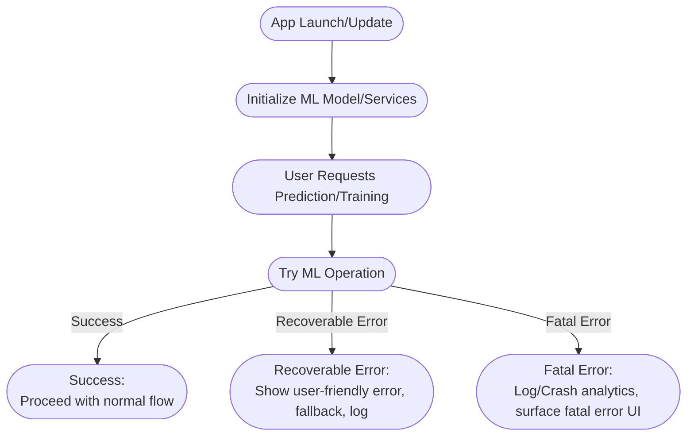

# On-Device Training Robustness: OS Cues, Session Management & Enhanced Logging

## Overview

This document outlines the production-ready infrastructure for robust on-device machine learning training in Bridget. The implementation focuses on three critical areas:

1. **OS Cues Integration** - Smart device awareness for optimal training conditions
2. **Session Management** - Persistent training sessions with recovery capabilities  
3. **Enhanced Logging** - Comprehensive diagnostics and user support

## Current Implementation Status

### ✅ Implemented Components
- **Core ML Training Framework** - MLUpdateTask integration with ANE optimization
- **Basic Error Handling** - CoreMLTrainingError types with recursion support
- **Progress Reporting** - Real-time UI updates via delegate pattern
- **Performance Logging** - PipelinePerformanceLogger for baseline metrics

### ❌ Missing Critical Components
- **OS Cues Integration** - Battery, thermal state, power mode monitoring
- **Training Session Persistence** - Resume interrupted training sessions
- **Background/Foreground Handling** - Seamless app lifecycle transitions
- **Enhanced Support Logging** - User diagnostics and failure analysis

## Production Workflow Diagrams

### 1. In-App Training & Retraining on Device

```mermaid
flowchart TD
    A([User Action<br/>(e.g., tap "Retrain")])
    B([Prepare Data<br/>(collect/select local set)])
    C([Show Training Progress UI])
    D([Run Training<br/>(CoreMLTraining/MLUpdateTask)])
    E([Monitor for Errors/Abort<br/>(battery, interruption)])
    F([Success:<br/>Save new model, notify UI])
    G([Error:<br/>Surface error, restore UI, log incident])

    A --> B --> C --> D --> E
    E -->|Success| F
    E -->|Error| G
```

**Key Features:**
- **Device Readiness Check** - Battery level, thermal state, power mode
- **Progress Monitoring** - Real-time training progress with cancellation support
- **Error Recovery** - Graceful failure handling with user-friendly messages
- **Session Persistence** - Resume training after interruptions

### 2. Deployment with Robust Error Handling (TestFlight/Production)



**Error Handling Strategy:**
- **Recoverable Errors** - Network issues, temporary device constraints
- **Fatal Errors** - Model corruption, critical system failures
- **User-Friendly Messages** - Clear, actionable error descriptions
- **Analytics Integration** - Crash reporting and performance monitoring

### 3. Continuous Model Improvement (Feedback Loop)

```mermaid
flowchart TD
    A([User Takes Action<br/>(route chosen, feedback)])
    B([Log Usage/Route History<br/>(UserRouteHistory, metrics)])
    C([Analyze Outcomes<br/>(predicted vs. actual, satisfaction)])
    D([Mark Data as "Used for Training"])
    E([Periodic or On-Demand Retraining<br/>(with new data)])
    F([Evaluate New Model<br/>(metrics, validation)])
    G([Deploy Model<br/>(device/App Store, notify user)])

    A --> B --> C --> D --> E --> F --> G
```

**Continuous Learning Features:**
- **Usage Analytics** - Track prediction accuracy and user satisfaction
- **Data Quality Assessment** - Validate training data before model updates
- **Model Validation** - Ensure new models meet performance thresholds
- **Incremental Updates** - Efficient model updates without full retraining

## Implementation Requirements

### 1. OS Cues Integration

#### Device Readiness Monitoring
```swift
// CoreMLTraining.swift additions
private func checkDeviceReadiness() throws {
    let processInfo = ProcessInfo.processInfo
    
    // Thermal state monitoring
    if processInfo.thermalState == .critical || processInfo.thermalState == .serious {
        throw CoreMLTrainingError.deviceNotReady(reason: "Device is thermally throttled")
    }
    
    // Battery level monitoring
    if UIDevice.current.isBatteryMonitoringEnabled {
        let batteryLevel = UIDevice.current.batteryLevel
        if batteryLevel < 0.2 && UIDevice.current.batteryState != .charging {
            throw CoreMLTrainingError.deviceNotReady(reason: "Battery level too low for training")
        }
    }
    
    // Power mode awareness
    if processInfo.isLowPowerModeEnabled {
        logger.warning("Training in low power mode - performance may be reduced")
    }
}
```

#### New Error Types
```swift
// CoreMLTrainingError additions
case deviceNotReady(reason: String)
case trainingInterrupted(reason: String)
case sessionRecoveryFailed(underlyingError: Error)
```

### 2. Training Session Management

#### Session Persistence
```swift
struct TrainingSession: Codable {
    let id: UUID
    let startTime: Date
    let config: CoreMLTrainingConfig
    let progress: Double
    let status: TrainingStatus
    let checkpointURL: URL?
    let deviceState: DeviceStateSnapshot
}

enum TrainingStatus: String, Codable {
    case running
    case paused
    case completed
    case failed
    case cancelled
}

struct DeviceStateSnapshot: Codable {
    let batteryLevel: Float
    let thermalState: ProcessInfo.ThermalState
    let isLowPowerMode: Bool
    let availableMemory: Int64
}
```

#### Session Recovery
```swift
private func resumeTrainingSession(_ session: TrainingSession) async throws {
    logger.info("Resuming training session: \(session.id)")
    
    // Validate device readiness
    try checkDeviceReadiness()
    
    // Load checkpoint if available
    if let checkpointURL = session.checkpointURL {
        try await loadTrainingCheckpoint(from: checkpointURL)
    }
    
    // Resume training with updated progress
    continueTraining(from: session.progress)
}
```

### 3. Enhanced Logging for Support

#### Training Session Diagnostics
```swift
private func logTrainingSession(for session: TrainingSession) {
    logger.info("""
    🎯 Training Session Started
    ID: \(session.id)
    Config: \(session.config)
    Device: \(UIDevice.current.model)
    OS: \(UIDevice.current.systemVersion)
    Memory: \(ProcessInfo.processInfo.physicalMemory) bytes
    Thermal State: \(ProcessInfo.processInfo.thermalState)
    Battery: \(UIDevice.current.batteryLevel * 100)%
    """)
}

private func logTrainingFailure(_ error: Error, session: TrainingSession) {
    logger.error("""
    ❌ Training Session Failed
    ID: \(session.id)
    Error: \(error.localizedDescription)
    Duration: \(Date().timeIntervalSince(session.startTime))s
    Progress: \(session.progress * 100)%
    Device State: \(getDeviceStateSummary())
    """)
}
```

#### User Support Integration
```swift
struct TrainingDiagnostics {
    let sessionID: UUID
    let deviceInfo: DeviceInfo
    let trainingMetrics: TrainingMetrics
    let errorLog: [String]
    let performanceData: PerformanceSnapshot
}

func generateSupportReport() -> TrainingDiagnostics {
    // Compile comprehensive diagnostics for user support
}
```

### 4. Background/Foreground Handling

#### App Lifecycle Integration
```swift
// MLPipelineViewModel.swift additions
private func setupAppLifecycleHandling() {
    NotificationCenter.default.addObserver(
        self,
        selector: #selector(appWillResignActive),
        name: UIApplication.willResignActiveNotification,
        object: nil
    )
    
    NotificationCenter.default.addObserver(
        self,
        selector: #selector(appDidBecomeActive),
        name: UIApplication.didBecomeActiveNotification,
        object: nil
    )
}

@objc private func appWillResignActive() {
    if isTraining {
        logger.info("App going to background - pausing training session")
        pauseTrainingSession()
    }
}

@objc private func appDidBecomeActive() {
    if let pausedSession = getPausedTrainingSession() {
        logger.info("App became active - resuming training session")
        resumeTrainingSession(pausedSession)
    }
}
```

### 5. Memory Pressure Handling

#### Dynamic Resource Management
```swift
private func handleMemoryPressure() {
    NotificationCenter.default.addObserver(
        self,
        selector: #selector(memoryWarningReceived),
        name: UIApplication.didReceiveMemoryWarningNotification,
        object: nil
    )
}

@objc private func memoryWarningReceived() {
    if isTraining {
        logger.warning("Memory pressure detected - reducing batch size")
        reduceTrainingBatchSize()
    }
}

private func reduceTrainingBatchSize() {
    // Dynamically adjust batch size based on available memory
    let availableMemory = getAvailableMemory()
    let newBatchSize = calculateOptimalBatchSize(for: availableMemory)
    updateTrainingConfiguration(batchSize: newBatchSize)
}
```

## Integration Points

### CoreMLTraining.swift Enhancements
- Device readiness monitoring
- Session persistence and recovery
- Enhanced error handling
- Memory pressure management

### MLPipelineViewModel.swift Enhancements
- App lifecycle handling
- Training session state management
- User-friendly error presentation
- Progress persistence

### PipelinePerformanceLogger.swift Enhancements
- Training session diagnostics
- Device state tracking
- Performance regression detection
- Support report generation

## Testing Strategy

### Unit Tests
- Device readiness validation
- Session persistence/restoration
- Error handling scenarios
- Memory pressure responses

### Integration Tests
- End-to-end training workflows
- Background/foreground transitions
- Error recovery scenarios
- Performance monitoring

### User Acceptance Tests
- Training interruption scenarios
- Error message clarity
- Session recovery usability
- Performance impact assessment

## Performance Considerations

### Battery Impact
- Monitor training duration and frequency
- Implement smart scheduling based on charging state
- Provide user controls for training preferences

### Memory Usage
- Dynamic batch size adjustment
- Checkpoint management for large models
- Memory pressure response strategies

### Thermal Management
- Thermal state monitoring during training
- Automatic training throttling
- User notifications for thermal constraints

## Security & Privacy

### Data Protection
- Training data remains on device
- No personal data transmitted
- Secure session storage
- Privacy-preserving analytics

### Model Security
- Secure model storage
- Integrity validation
- Tamper detection
- Secure checkpoint management

## Future Enhancements

### Advanced Features
- **Federated Learning** - Collaborative model improvement
- **Model Compression** - Efficient model storage and transfer
- **Adaptive Training** - Dynamic hyperparameter adjustment
- **Predictive Maintenance** - Proactive model health monitoring

### Analytics Integration
- **Performance Metrics** - Training efficiency tracking
- **User Behavior Analysis** - Usage pattern optimization
- **Model Performance Tracking** - Accuracy and reliability monitoring
- **System Health Monitoring** - Device and app performance tracking

## Conclusion

This robust on-device training infrastructure ensures Bridget can provide reliable, user-friendly machine learning capabilities while respecting device constraints and user privacy. The implementation prioritizes:

1. **Reliability** - Robust error handling and recovery
2. **User Experience** - Seamless training with clear feedback
3. **Performance** - Optimized resource usage and battery life
4. **Privacy** - On-device processing with secure data handling

The workflow diagrams provide clear guidance for implementation, while the detailed requirements ensure comprehensive coverage of production scenarios.

