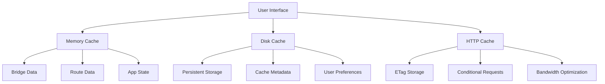
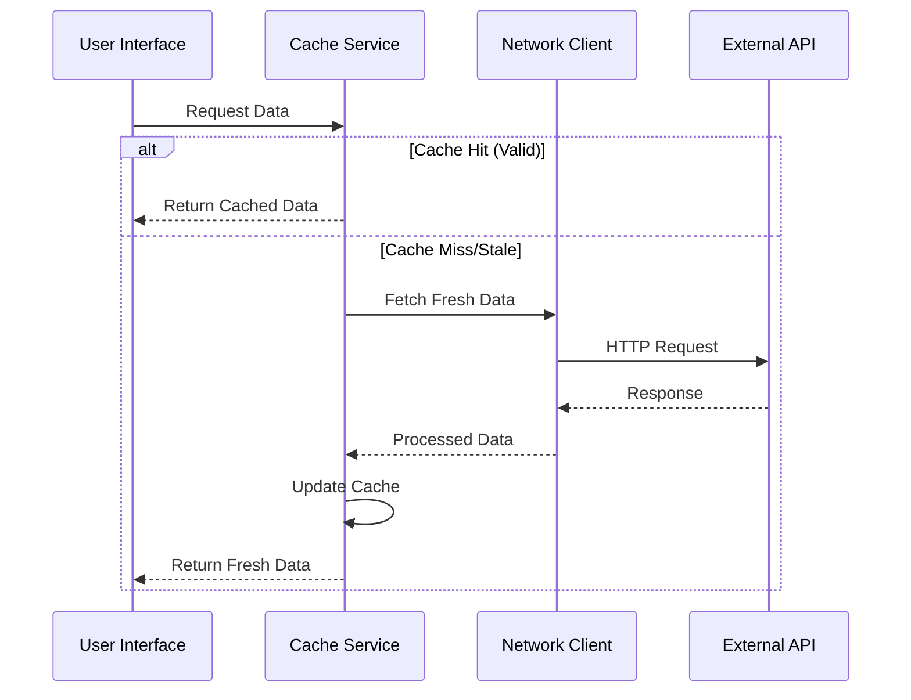

# Caching Strategy

## Overview

Bridget implements a sophisticated multi-level caching strategy designed to provide fast, reliable data access while minimizing network usage and supporting offline functionality. The caching system prioritizes user experience through intelligent cache management and graceful degradation.

## Caching Architecture

### Multi-Level Cache Design



### Cache Levels

#### 1. Memory Cache (L1 Cache)
**Purpose**: Fastest data access for frequently used information
**Storage**: In-memory data structures
**Characteristics**:
- **Speed**: Sub-millisecond access times
- **Volatility**: Lost on app termination
- **Size**: Limited by available memory
- **Scope**: App session only

**Cached Data**:
- Current bridge status models
- Generated route data
- App state information
- UI component data

#### 2. Disk Cache (L2 Cache)
**Purpose**: Persistent storage for offline access and data persistence
**Storage**: UserDefaults, Core Data, or file system
**Characteristics**:
- **Speed**: Millisecond access times
- **Persistence**: Survives app restarts
- **Size**: Limited by device storage
- **Scope**: App lifetime

**Cached Data**:
- Historical bridge opening data
- Generated route models
- Cache metadata and timestamps
- User preferences and settings

#### 3. HTTP Cache (L3 Cache)
**Purpose**: Network-level caching for bandwidth optimization
**Storage**: URLSession cache, ETag storage
**Characteristics**:
- **Speed**: Network-dependent
- **Persistence**: System-managed
- **Size**: System-controlled
- **Scope**: System-wide

**Cached Data**:
- HTTP response headers
- ETag values for conditional requests
- Response metadata
- Cache control directives

## Cache-First Strategy

### Implementation Approach

**Primary Strategy**: Check cache before making network requests
**Fallback Strategy**: Network fetch with cache update
**Degradation Strategy**: Sample data when all else fails

### Cache-First Flow



### Cache Validation Rules

#### Freshness Validation
**Time-Based Expiration**:
- **Bridge Data**: 24 hours maximum age
- **Route Data**: 12 hours maximum age
- **App State**: 1 hour maximum age
- **User Preferences**: No expiration

**Validation Logic**:
```swift
let isFresh = Date().timeIntervalSince(lastUpdated) < cacheExpiration
```

#### Completeness Validation
**Data Integrity Checks**:
- Required fields present
- Valid data structure
- Non-empty collections
- Valid date ranges

**Schema Version Validation**:
- Cache data matches current schema
- Automatic migration for schema changes
- Version compatibility checking

#### Quality Validation
**Data Quality Metrics**:
- Minimum record count
- Valid coordinate data
- Reasonable date ranges
- Consistent data format

## Cache Management

### Cache Operations

#### Write Operations
**Cache Update Process**:
1. **Data Validation**: Verify data integrity
2. **Metadata Creation**: Generate cache metadata
3. **Storage**: Write to appropriate cache level
4. **Index Update**: Update cache indices
5. **Cleanup**: Remove stale entries

**Cache Metadata**:
```swift
struct CacheMetadata {
    let lastUpdated: Date
    let cacheExpiration: TimeInterval
    let dataVersion: String
    let size: Int64
    let checksum: String
    let source: String
}
```

#### Read Operations
**Cache Retrieval Process**:
1. **Cache Check**: Look for data in memory cache
2. **Cache Miss**: Check disk cache
3. **Validation**: Verify cache freshness and integrity
4. **Return**: Return valid cached data
5. **Update**: Refresh memory cache if needed

#### Update Operations
**Cache Refresh Process**:
1. **Background Fetch**: Fetch fresh data in background
2. **Validation**: Verify new data quality
3. **Update**: Replace cached data atomically
4. **Notification**: Notify UI of data updates
5. **Cleanup**: Remove old cache entries

#### Eviction Operations
**Cache Cleanup Process**:
1. **Size Check**: Monitor cache size limits
2. **Age Check**: Identify stale entries
3. **Priority Check**: Determine eviction priority
4. **Removal**: Delete selected entries
5. **Compaction**: Optimize storage space

### Cache Policies

#### LRU (Least Recently Used) Eviction
**Implementation**: Track access times for cache entries
**Eviction Criteria**: Remove least recently accessed entries
**Benefits**: Keep frequently used data in cache
**Use Case**: Memory cache management

#### TTL (Time To Live) Eviction
**Implementation**: Automatic expiration based on timestamps
**Eviction Criteria**: Remove entries older than TTL
**Benefits**: Ensure data freshness
**Use Case**: Data freshness requirements

#### Size-Based Eviction
**Implementation**: Monitor cache size and remove entries
**Eviction Criteria**: Remove largest or oldest entries
**Benefits**: Prevent cache bloat
**Use Case**: Disk cache management

### Cache Performance Optimization

#### Memory Optimization
**Strategies**:
- **Lazy Loading**: Load data on-demand
- **Compression**: Compress cached data
- **Pagination**: Load data in chunks
- **Background Processing**: Process data off-main-thread

#### Storage Optimization
**Strategies**:
- **Deduplication**: Remove duplicate entries
- **Compression**: Compress stored data
- **Indexing**: Optimize data retrieval
- **Partitioning**: Split large datasets

#### Network Optimization
**Strategies**:
- **Conditional Requests**: Use ETags and If-None-Match
- **Request Batching**: Combine multiple requests
- **Response Compression**: Minimize bandwidth usage
- **Connection Pooling**: Reuse HTTP connections

## Cache Implementation Details

### CacheService Architecture

**Core Components**:
- **CacheManager**: Orchestrates cache operations
- **MemoryCache**: Fast in-memory storage
- **DiskCache**: Persistent storage layer
- **CacheValidator**: Validates cache integrity
- **CacheMetrics**: Tracks cache performance

**Key Methods**:
```swift
class CacheService {
    func get<T: Codable>(_ key: String) async throws -> T?
    func set<T: Codable>(_ value: T, for key: String) async throws
    func remove(_ key: String) async throws
    func clear() async throws
    func getSize() -> Int64
    func getMetrics() -> CacheMetrics
}
```

### Cache Data Structures

#### Bridge Data Cache
**Structure**: Array of BridgeStatusModel instances
**Metadata**: Last update time, data version, record count
**Validation**: Bridge ID validation, date range checking

#### Route Data Cache
**Structure**: Array of RouteModel instances
**Metadata**: Generation timestamp, score calculations
**Validation**: Route completeness, bridge references

#### App State Cache
**Structure**: AppStateModel with cache metadata
**Metadata**: UI state, user preferences, navigation state
**Validation**: State consistency, preference validity

### Cache Synchronization

#### Concurrent Access
**Thread Safety**: All cache operations are thread-safe
**Locking Strategy**: Use appropriate locks for concurrent access
**Atomic Operations**: Ensure data consistency during updates

#### Cache Coherency
**Consistency**: Ensure cache data is consistent across levels
**Invalidation**: Properly invalidate related cache entries
**Synchronization**: Coordinate updates across cache levels

## Offline Support

### Offline Detection
**Network Monitoring**: Monitor network connectivity status
**Offline Indicators**: Show offline status to users
**Graceful Degradation**: Provide functionality with cached data

### Offline Functionality
**Available Features**:
- View cached bridge data
- Browse historical routes
- Access user preferences
- Basic navigation

**Limited Features**:
- Fresh data updates
- Real-time information
- Advanced analytics
- Social features

### Data Synchronization
**Sync Strategy**: Background sync when network available
**Conflict Resolution**: Handle data conflicts gracefully
**Priority Sync**: Sync critical data first

## Performance Monitoring

### Cache Metrics
**Key Metrics**:
- **Hit Rate**: Percentage of cache hits vs misses
- **Miss Rate**: Percentage of cache misses
- **Eviction Rate**: Frequency of cache evictions
- **Size**: Current cache size and growth
- **Access Patterns**: Most/least accessed data

### Performance Indicators
**Response Times**:
- Memory cache access: <1ms
- Disk cache access: <10ms
- Network fetch: <1000ms
- Cache miss penalty: <50ms

**Resource Usage**:
- Memory consumption: <50MB
- Disk usage: <100MB
- Network bandwidth: <1MB per request
- CPU usage: <5% during cache operations

### Monitoring Tools
**Built-in Metrics**: Cache performance tracking
**Debug Logging**: Detailed cache operation logs
**Performance Profiling**: Cache performance analysis
**User Analytics**: Cache effectiveness measurement

## Best Practices

### Cache Design Principles
1. **Cache-First**: Always check cache before network
2. **Graceful Degradation**: Provide functionality with cached data
3. **Freshness Balance**: Balance data freshness with performance
4. **Size Management**: Prevent cache bloat
5. **Error Handling**: Handle cache failures gracefully
6. **Monitoring**: Track cache performance and effectiveness

### Implementation Guidelines
1. **Use Appropriate Cache Levels**: Match data to cache level
2. **Validate Cache Data**: Always validate cached data
3. **Handle Cache Misses**: Provide fallback strategies
4. **Monitor Cache Performance**: Track metrics and optimize
5. **Test Cache Scenarios**: Test cache hit/miss scenarios
6. **Document Cache Behavior**: Document cache policies and behavior

### Code Examples

#### Cache-First Data Loading
```swift
func loadBridgeData() async throws -> [BridgeStatusModel] {
    // Check cache first
    if let cachedData = try await cacheService.get("bridgeData") {
        return cachedData
    }
    
    // Fetch from network if cache miss
    let freshData = try await networkClient.fetchBridgeData()
    
    // Update cache with fresh data
    try await cacheService.set(freshData, for: "bridgeData")
    
    return freshData
}
```

#### Cache Validation
```swift
func validateCache<T: Codable>(_ data: T, metadata: CacheMetadata) -> Bool {
    // Check freshness
    let isFresh = Date().timeIntervalSince(metadata.lastUpdated) < cacheExpiration
    
    // Check schema version
    let isCompatible = metadata.dataVersion == currentSchemaVersion
    
    // Check data integrity
    let isValid = validateDataIntegrity(data)
    
    return isFresh && isCompatible && isValid
}
```

## Future Enhancements

### Planned Improvements
- **Predictive Caching**: Pre-cache likely-needed data
- **Intelligent Eviction**: ML-based cache eviction decisions
- **Distributed Caching**: Share cache across app instances
- **Advanced Compression**: Better data compression algorithms
- **Cache Analytics**: Detailed cache performance insights
- **Auto-Optimization**: Automatic cache parameter tuning 