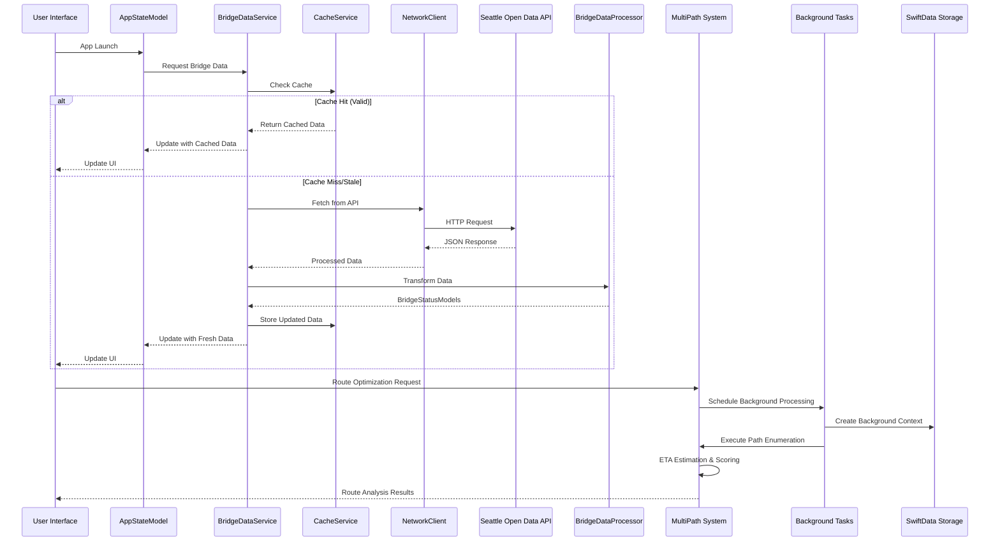

# Data Flow

## Overview

Bridget implements a sophisticated data flow that prioritizes user experience through caching, error handling, and reactive state management. The system now includes a comprehensive MultiPath traffic prediction pipeline with background task processing, statistical modeling, and performance monitoring. This document details how data moves through the system from external APIs to the user interface, including the advanced MultiPath system.

## Data Flow Architecture

### High-Level Flow

## MultiPath System Data Flow

### 1. Path Enumeration Pipeline

**Input**: Origin, destination, departure time, configuration
**Output**: Candidate paths with travel times and bridge crossings

**Flow**:
1. **Graph Loading**: Load Seattle bridge network from JSON datasets
2. **Algorithm Selection**: Choose DFS or Yen's based on graph size and K parameter
3. **Path Enumeration**: Generate candidate paths with pruning constraints
4. **Validation**: Ensure path contiguity and respect configuration limits

**Key Components**:
- `PathEnumerationService`: Core enumeration engine
- `Graph`: Network representation with adjacency lists
- `PathEnumConfig`: Enumeration parameters and constraints

### 2. ETA Estimation Pipeline

**Input**: RoutePath, departure time, traffic profiles
**Output**: ETA estimates with statistical uncertainty

**Flow**:
1. **Edge Traversal**: Advance time on each edge (bridge or road)
2. **Traffic Modeling**: Apply time-of-day multipliers and weekend adjustments
3. **Statistical Calculation**: Compute mean, variance, confidence intervals
4. **Uncertainty Quantification**: Generate comprehensive statistical summaries

**Key Components**:
- `ETAEstimator`: Statistical ETA computation
- `TrafficProfileProvider`: Time-of-day traffic patterns
- `ETASummary`: Statistical uncertainty representation

### 3. Bridge Prediction Pipeline

**Input**: Bridge IDs, ETAs, feature vectors
**Output**: Bridge opening probabilities with confidence scores

**Flow**:
1. **Feature Engineering**: Generate bridge-specific and time-based features
2. **Historical Data**: Query HistoricalBridgeDataProvider for opening rates
3. **Prediction**: Use BaselinePredictor or ML model for probability estimation
4. **Batch Processing**: Efficient prediction for multiple bridges

**Key Components**:
- `BridgeOpenPredictor`: Prediction protocol implementation
- `BaselinePredictor`: Beta smoothing with historical calibration
- `HistoricalBridgeDataProvider`: Historical data access
- `FeatureEngineeringService`: Feature vector generation

### 4. Path Scoring & Aggregation Pipeline

**Input**: Paths with bridge probabilities, feature vectors
**Output**: Path scores and network-level probability

**Flow**:
1. **Feature Caching**: Check cache for existing feature vectors
2. **Log-Domain Math**: Convert probabilities to log domain for numerical stability
3. **Path Scoring**: Compute individual path probabilities
4. **Network Aggregation**: Calculate anyPathOK using union (not sum)

**Key Components**:
- `PathScoringService`: End-to-end scoring pipeline
- `FeatureCache`: Thread-safe feature vector caching
- `JourneyAnalysis`: Complete analysis results

## Background Task Data Flow

### 1. Task Scheduling

**Trigger**: App lifecycle events, user actions, or scheduled intervals
**Flow**:
1. **Task Registration**: Register background task identifiers with iOS
2. **Schedule Management**: Intelligent scheduling with debouncing
3. **Context Creation**: Create SwiftData ModelContext for background operations
4. **Task Execution**: Execute task with proper completion handling

**Key Components**:
- `MLPipelineBackgroundManager`: Task orchestration
- `BGTaskScheduler`: iOS background task management
- `ModelContainer`: SwiftData container for background contexts

### 2. Background Processing

**Input**: Background task with ModelContext
**Output**: Updated data and performance metrics

**Flow**:
1. **Data Population**: Update bridge opening statistics and historical data
2. **Data Export**: Export performance metrics and cache statistics
3. **Maintenance**: Clean up old data and optimize performance
4. **Metrics Collection**: Gather performance and cache statistics

**Key Components**:
- `ProbeTickDataService`: Bridge data population
- `BridgeDataExporter`: Data export and analysis
- `PipelinePerformanceLogger`: Performance monitoring

### 3. Performance Monitoring

**Input**: Runtime metrics and cache statistics
**Output**: Performance reports and optimization insights

**Flow**:
1. **Metrics Collection**: Gather timing, memory, and cache statistics
2. **Statistical Analysis**: Compute means, standard deviations, percentiles
3. **Performance Logging**: Log performance data for analysis
4. **Cache Optimization**: Monitor cache hit rates and optimize strategies

**Key Components**:
- `ScoringMetrics`: Performance metrics aggregation
- `CacheStatistics`: Cache performance monitoring
- `PipelinePerformanceLogger`: Comprehensive logging

## SwiftData Integration

### 1. Context Management

**Main Context**: UI operations and user interactions
**Background Context**: Background task processing and data updates

**Flow**:
1. **Context Creation**: Create appropriate context for operation type
2. **Data Operations**: Perform SwiftData operations within context
3. **Context Lifecycle**: Proper context lifecycle management
4. **Error Handling**: Graceful handling of context errors

### 2. Data Persistence

**Input**: Bridge data, performance metrics, cache statistics
**Output**: Persistent storage with proper error handling

**Flow**:
1. **Data Validation**: Validate data before persistence
2. **Transaction Management**: Use SwiftData transactions for consistency
3. **Error Handling**: Handle persistence errors gracefully
4. **Performance Optimization**: Optimize for background operations

## Cache Strategy

### 1. Multi-Level Caching

**Feature Cache**: Bridge-specific features with 5-minute time buckets
**Path Cache**: Enumerated paths with memoization
**Data Cache**: Bridge status and historical data

**Flow**:
1. **Cache Check**: Check appropriate cache level for data
2. **Cache Hit**: Return cached data with performance metrics
3. **Cache Miss**: Generate data and update cache
4. **Cache Management**: Eviction and size management

### 2. Cache Performance Monitoring

**Input**: Cache operations and hit rates
**Output**: Performance insights and optimization recommendations

**Flow**:
1. **Statistics Collection**: Gather cache hit/miss statistics
2. **Performance Analysis**: Analyze cache performance patterns
3. **Optimization**: Adjust cache strategies based on performance
4. **Reporting**: Provide cache performance insights

## Error Handling & Resilience

### 1. MultiPath Error Handling

**Input Validation**: Validate all input parameters and configurations
**Algorithm Errors**: Handle path enumeration and scoring errors
**Data Errors**: Handle missing or invalid bridge data
**Performance Errors**: Handle timeout and resource constraints

**Flow**:
1. **Error Detection**: Detect errors at appropriate levels
2. **Error Classification**: Classify errors by type and severity
3. **Error Recovery**: Attempt recovery where possible
4. **Error Reporting**: Report errors with context and suggestions

### 2. Background Task Resilience

**Task Expiration**: Handle task expiration gracefully
**Context Errors**: Handle SwiftData context errors
**Network Errors**: Handle network connectivity issues
**Resource Errors**: Handle memory and performance constraints

**Flow**:
1. **Error Detection**: Detect errors during task execution
2. **Task Completion**: Complete task with appropriate success/failure status
3. **Error Logging**: Log errors for debugging and monitoring
4. **Recovery Planning**: Plan for error recovery and retry

## Performance Optimization

### 1. Algorithm Selection

**DFS Algorithm**: Simple path enumeration for small graphs
**Yen's Algorithm**: K-shortest paths for large networks
**Auto-Selection**: Dynamic algorithm choice based on parameters

**Flow**:
1. **Parameter Analysis**: Analyze graph size and K parameter
2. **Algorithm Choice**: Select appropriate algorithm
3. **Performance Monitoring**: Monitor algorithm performance
4. **Optimization**: Optimize based on performance data

### 2. Batch Processing

**Feature Generation**: Batch feature generation for multiple bridges
**Bridge Prediction**: Batch prediction for multiple bridges
**Path Scoring**: Batch scoring for multiple paths

**Flow**:
1. **Batch Preparation**: Prepare batch of operations
2. **Batch Execution**: Execute batch efficiently
3. **Result Processing**: Process batch results
4. **Performance Analysis**: Analyze batch performance

## Data Quality & Validation

### 1. Input Validation

**Graph Validation**: Validate network connectivity and constraints
**Bridge Validation**: Validate bridge IDs and metadata
**Configuration Validation**: Validate algorithm parameters
**Data Validation**: Validate input data quality

**Flow**:
1. **Validation Rules**: Apply appropriate validation rules
2. **Error Detection**: Detect validation errors
3. **Error Reporting**: Report validation errors clearly
4. **Recovery**: Suggest recovery actions

### 2. Output Validation

**Path Validation**: Validate generated paths
**Probability Validation**: Validate probability calculations
**Statistical Validation**: Validate statistical measures
**Performance Validation**: Validate performance metrics

**Flow**:
1. **Output Checking**: Check output validity
2. **Constraint Verification**: Verify output constraints
3. **Quality Assessment**: Assess output quality
4. **Error Handling**: Handle output errors

## Monitoring & Observability

### 1. Performance Metrics

**Timing Metrics**: Path enumeration, ETA estimation, scoring times
**Memory Metrics**: Memory usage and allocation patterns
**Cache Metrics**: Cache hit rates and performance
**Algorithm Metrics**: Algorithm performance and efficiency

**Flow**:
1. **Metrics Collection**: Collect performance metrics
2. **Statistical Analysis**: Analyze metric patterns
3. **Performance Logging**: Log performance data
4. **Optimization**: Use metrics for optimization

### 2. Error Monitoring

**Error Rates**: Track error frequencies and patterns
**Error Types**: Categorize errors by type and severity
**Error Context**: Capture error context and conditions
**Error Trends**: Monitor error trends over time

**Flow**:
1. **Error Tracking**: Track all errors and exceptions
2. **Error Analysis**: Analyze error patterns and causes
3. **Error Reporting**: Report errors for debugging
4. **Prevention**: Use insights to prevent future errors

## Future Enhancements

### 1. ML Model Integration

**Feature Contracts**: Freeze feature vector specifications
**Model Wrapping**: Protocol-based model integration
**A/B Testing**: Seamless switching between models
**Training Pipeline**: Dataset generation and model training

### 2. Real-Time Integration

**Live Data Sources**: Real-time bridge status updates
**Traffic Profiles**: Dynamic traffic pattern integration
**User Feedback**: Learning from user preferences
**Predictive Analytics**: Advanced prediction models

### 3. Performance Optimization

**Parallel Processing**: Multi-threaded operations
**Advanced Caching**: Intelligent cache strategies
**Memory Optimization**: Advanced memory management
**Algorithm Optimization**: Continuous algorithm improvement 
