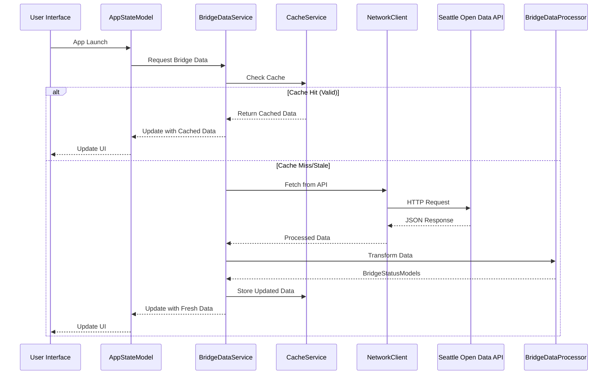

# Data Flow

## Overview

Bridget implements a sophisticated data flow that prioritizes user experience through caching, error handling, and reactive state management. This document details how data moves through the system from external APIs to the user interface.

## Data Flow Architecture

### High-Level Flow



## Detailed Data Flow

### 1. Application Initialization

**Trigger**: App launch or foreground activation

**Flow**:
1. `BridgetApp` initializes SwiftData `ModelContainer`
2. `ContentView` creates `AppStateModel` instance
3. `AppStateModel` triggers initial data load
4. `BridgeDataService` begins data acquisition process

**Key Components**:
- `BridgetApp`: Application lifecycle management
- `ContentView`: Root view coordinator
- `AppStateModel`: Global state management

### 2. Cache-First Data Strategy

**Strategy**: Check cache before making network requests

**Flow**:
1. **Cache Check**: `BridgeDataService` queries `CacheService`
2. **Cache Validation**: Verify cache freshness and validity
3. **Cache Hit**: Return cached data if valid
4. **Cache Miss**: Proceed to network fetch

**Cache Validation Rules**:
- **Freshness**: Cache must be less than 24 hours old
- **Completeness**: Cache must contain valid bridge data
- **Schema Version**: Cache must match current data schema

**Benefits**:
- **Fast Response**: Immediate data availability
- **Offline Support**: Works without network connectivity
- **Reduced Bandwidth**: Minimizes API calls
- **Better UX**: No loading delays for cached data

### 3. Network Data Acquisition

**Trigger**: Cache miss, stale data, or manual refresh

**Flow**:
1. **Request Preparation**: `NetworkClient` prepares HTTP request
2. **Request Execution**: Send request to Seattle Open Data API
3. **Response Validation**: Validate HTTP response and content
4. **Data Processing**: Transform raw JSON to structured data
5. **Cache Update**: Store fresh data in cache
6. **State Update**: Update application state

**API Endpoint**: `https://data.seattle.gov/resource/gm8h-9449.json`

**Request Headers**:
```http
Accept: application/json
User-Agent: Bridget/1.0
```

**Response Validation**:
- **HTTP Status**: Must be 200 OK
- **Content-Type**: Must be `application/json`
- **Payload Size**: Must be under 5MB
- **Data Structure**: Must be valid JSON array

### 4. Data Processing Pipeline

**Raw Data**: JSON array of bridge opening records

**Processing Steps**:
1. **JSON Decoding**: Parse raw JSON into `BridgeOpeningRecord` structs
2. **Data Validation**: Filter out invalid or incomplete records
3. **Business Logic**: Apply business rules and transformations
4. **Model Creation**: Create `BridgeStatusModel` instances
5. **Route Generation**: Generate `RouteModel` instances with scoring

**Data Validation Rules**:
- **Required Fields**: All essential fields must be present
- **Bridge ID Validation**: Only known bridge IDs (1-10)
- **Date Range**: Records within 10 years back, 1 year forward
- **Coordinate Validation**: Valid latitude/longitude values

**Business Logic**:
- **Record Grouping**: Group records by bridge ID
- **Opening Aggregation**: Calculate total openings per bridge
- **Frequency Analysis**: Determine opening patterns
- **Route Scoring**: Calculate optimization scores

### 5. State Management Flow

**Reactive Updates**: Changes propagate automatically through Observation framework

**Flow**:
1. **Data Update**: `BridgeDataService` updates `AppStateModel`
2. **State Change**: `AppStateModel` properties change
3. **UI Notification**: SwiftUI views automatically update
4. **View Refresh**: UI reflects new data state

**State Properties**:
- `routes`: Array of available routes
- `isLoading`: Loading state indicator
- `error`: Current error state
- `selectedRouteID`: Currently selected route

**Reactive Characteristics**:
- **Automatic Updates**: UI updates without manual refresh
- **Granular Updates**: Only changed views update
- **Performance Optimized**: Efficient observation tracking

### 6. Error Handling Flow

**Error Classification**: Comprehensive error categorization and handling

**Error Types**:
- **Network Errors**: Connection failures, timeouts, HTTP errors
- **Data Errors**: Invalid JSON, missing fields, parsing failures
- **Business Errors**: Invalid bridge IDs, out-of-range dates
- **Cache Errors**: Storage failures, corruption

**Error Flow**:
1. **Error Detection**: Error occurs in service layer
2. **Error Classification**: Categorize error type and severity
3. **Error Propagation**: Pass error up through service hierarchy
4. **State Update**: Update `AppStateModel` with error state
5. **UI Update**: Display appropriate error message to user
6. **Recovery Options**: Provide retry mechanisms

**Error Recovery**:
- **Automatic Retry**: Exponential backoff for transient errors
- **Manual Retry**: User-initiated retry buttons
- **Fallback Data**: Sample data when all else fails
- **Graceful Degradation**: Partial functionality when possible

### 7. Caching Strategy

**Multi-Level Caching**: Comprehensive caching for optimal performance

**Cache Levels**:
1. **Memory Cache**: Fast access to frequently used data
2. **Disk Cache**: Persistent storage for offline access
3. **HTTP Cache**: Future ETag support for bandwidth optimization

**Cache Operations**:
- **Write**: Store fresh data with metadata
- **Read**: Retrieve cached data with validation
- **Update**: Refresh existing cache entries
- **Eviction**: Remove stale or oversized cache entries

**Cache Metadata**:
- `lastUpdated`: Timestamp of last successful fetch
- `cacheExpiration`: Time-based invalidation
- `dataVersion`: Schema version for migration
- `size`: Cache entry size for management

### 8. Background Processing

**Asynchronous Operations**: Non-blocking data processing

**Background Tasks**:
- **Network Requests**: HTTP requests on background queues
- **Data Processing**: JSON parsing and transformation
- **Cache Operations**: Disk I/O operations
- **Route Generation**: Computational intensive scoring

**Threading Strategy**:
- **Main Thread**: UI updates and user interactions
- **Background Queues**: Network and processing operations
- **Serial Queues**: Cache operations for consistency
- **Concurrent Queues**: Parallel data processing

### 9. Performance Optimization

**Optimization Strategies**: Multiple approaches for optimal performance

**Memory Optimization**:
- **Lazy Loading**: Load data on-demand
- **Image Caching**: Efficient image storage and retrieval
- **Memory Pressure**: Respond to system memory warnings
- **Cache Eviction**: Automatic cleanup of old data

**Network Optimization**:
- **Request Batching**: Combine multiple requests
- **Response Compression**: Minimize bandwidth usage
- **Conditional Requests**: Future ETag support
- **Connection Pooling**: Reuse HTTP connections

**UI Optimization**:
- **Lazy Views**: Load UI components on-demand
- **Observation Tracking**: Efficient state observation
- **Background Updates**: Update UI on background threads
- **View Recycling**: Reuse view components

## Data Transformation Examples

### Raw API Response
```json
[
  {
    "entitytype": "Bridge",
    "entityname": "1st Ave South",
    "entityid": "1",
    "opendatetime": "2025-01-03T10:12:00.000",
    "closedatetime": "2025-01-03T10:20:00.000",
    "minutesopen": "8",
    "latitude": "47.542213439941406",
    "longitude": "-122.33446502685547"
  }
]
```

### Processed BridgeStatusModel
```swift
BridgeStatusModel(
    bridgeName: "1st Ave South",
    apiBridgeID: "1",
    historicalOpenings: [Date],
    realTimeDelay: nil
)
```

### Generated RouteModel
```swift
RouteModel(
    routeID: "Route-1",
    bridges: [BridgeStatusModel],
    score: 0.85,
    complexity: 3
)
```

## Monitoring and Analytics

### Performance Metrics
- **Load Time**: Time from request to UI update
- **Cache Hit Rate**: Percentage of cache hits vs misses
- **Error Rate**: Frequency of different error types
- **Memory Usage**: Application memory consumption

### User Experience Metrics
- **Time to Interactive**: Time until user can interact
- **Error Recovery**: Success rate of error recovery
- **Offline Usage**: Usage patterns when offline
- **Route Selection**: Most popular route selections

### Debugging Information
- **Request Logs**: Detailed network request information
- **Cache Logs**: Cache hit/miss and storage operations
- **Error Logs**: Comprehensive error context and stack traces
- **Performance Logs**: Timing information for operations 
